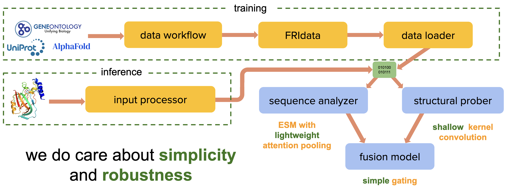

# deepFRI2

deepFRI2 is an upgraded version of the well-established [deepFRI](https://www.nature.com/articles/s41467-021-23303-9) (*Deep Functional Residue Identification*) framework for predicting protein function using [Gene Ontology](https://geneontology.org/) (GO) terms and [Enzyme Commission](https://enzyme.expasy.org/) (EC) numbers.

Like its predecessor, deepFRI2 operates in two complementary modes: sequence-based and sequence–structure-based. This dual approach enables robust functional inference in metagenomic settings — where protein structures are often unavailable — as well as structure-informed functional annotation when structural information is available.

For training, deepFRI2 leverages [FRIData](https://github.com/Tomasz-Lab/FRIdata), a scalable and efficient library for generating large, non-redundant protein datasets.

While maintaining similar input and output formats, the model architecture has been completely redesigned to incorporate recent advances in the field, particularly the use of protein language models as powerful representations of protein sequences. It consists of two submodules: sequence analyzer (utilizing ESM embeddings and lightweight attention pooling) and structural prober (processing distograms with shallow convolutional network). Signals from both models are merged using an ESM-conditioned gating mechanism. deepFRI2 outputs sequence-, structure-, and fusion-based predictions for each ontology (MF, CC, BP). The architecture is intentionally simple yet robust, enabling accurate functional annotation while maintaining high scalability and interpretability.



## Installation

### Prerequisites

- `conda` or `mamba`
- For **GPU** inference: an NVIDIA GPU with a driver supporting CUDA 12.6
- For **CPU** inference: no additional requirements

### Install deepFRI2

```bash
# Clone the repository
git clone https://github.com/Tomasz-Lab/deepFRI2.git
cd deepFRI2

# Create the environment (choose ONE)
conda env create -f environment-gpu.yml    # Recommended (GPU)
# conda env create -f environment-cpu.yml  # CPU-only

# Activate the environment
conda activate deepfri2

# Download the ESM-2 language model (~2.5 GB)
python src/deepFRI2/download_esm.py
```

### Notes

- GPU environment is named `deepfri2`, whereas CPU environment is named `deepfri2_cpu` (name can be changed in the corressponding `.yml` file).
- The deepFRI2 model checkpoints are already included under `params/<ontology>/`. Only the ESM-2 weights (downloaded in the last step) need to be fetched.
- Once the ESM-2 weights are downloaded, all inference runs entirely offline.

## Usage
 
Predict GO terms for a folder of protein structures (`.cif` / `.pdb`):

```bash
python src/deepFRI2/deepfri2.py --input_dir path/to/structures
```

Options (run `python src/deepFRI2/deepfri2.py --help` for the full list):

| Flag | Description |
| --- | --- |
| `-i`, `--input_dir` | Folder with `.cif` / `.pdb` structures. **(required)** |
| `-o`, `--output_dir` | Folder for results (default: `<repo>/results`). |
| `-f`, `--ids_file` | Text file listing structures to run, one per line. Each entry is an id, optionally with a `.cif` / `.pdb` extension and/or a relative subfolder path (`abCD`, `abCD.cif`, `sub/abCD`, `sub1/sub2/abCD.cif`), resolved under the input folder. An id without an extension resolves to `.cif` if present, else `.pdb`. Default: all top-level files in the input folder. |
| `-a`, `--aspect` | Comma-separated GO aspects (ontologies) to run: any of `MF`, `CC`, `BP` (case-insensitive). Default: `mf,cc,bp`. |
| `-b`, `--batch_size` | Proteins per inference batch (default: `32`). |
| `-t`, `--threshold` | Keep a GO term in the summary if **any** model scores ≥ threshold. Either one float applied to all models (`0.1`) or two comma-separated floats applied to fusion/sequence and structure respectively (`0.1,0.2`). The structural prober is trained with a different loss and outputs higher probabilities on average, hence the higher default for it. `0` (or `0,0`) keeps everything; `1` (or `1,1`) keeps nothing (default: `0.1,0.2`). |
| `-k`, `--top_k` | Maximum GO terms per protein in the summary (default: all selected). |
| `-p`, `--prop` | Propagate scores up the GO hierarchy. Adds the `preds_propagated/` folder and the propagated columns to the summary (default: off). |
| `-s`, `--summary` | Write only `prediction_summary.csv`, skipping the `preds/` (and `preds_propagated/`) folders (default: off). With `--prop`, the summary still includes the propagated columns. |
| `-v`, `--verbose` | Enable debug logging (default: off). |

### Example 

Run a subset of structures with a stricter (global) thresholds:

```bash
python src/deepFRI2/deepfri2.py -i structures/ -o results/run1 -f ids.txt -t 0.3
```

### Notes

- GPU environment is the default and recommended one.
- CPU probabilities may differ from the GPU probabilities on structure/fusion models due to bf16 autocast on GPU only. GO ranking and thresholded term sets remain similar but sometimes are not identical.
- In the current setup, the model processes up to 1020 aa (longer proteins are truncated). There is no lower limit; however, the structural prober is not sensitive to proteins shorter than 60 aa (in which case predictions equal the mean across the training data).
- The current version was trained on gapless structures, so **fully resolved inputs (no missing residues) are recommended**. For structures with gaps, a missing residue zeroes out its whole row/column in the residue–residue similarity map, breaking the backbone-adjacency band and pushing the structure model out of distribution. As a rough safeguard we fill only the immediate `-1/+1` off-diagonals at gap positions with `1` (a non-zero, "these consecutive residues are neighbours" signal). This is deliberately minimal: farther-from-diagonal entries decay in value, so forcing `1` there would inject an artificial bias. A more principled fill (e.g. using the Gaussian-consistent ~0.93 for adjacency, or mean/median of real distances) may come in a future release.
  
## Output

Predictions are written under the output folder for ontologies selected by the `--aspect` argument (MF, CC, BP by default):

- `prediction_summary.csv` — top predicted GO terms per protein, with raw scores for the fusion, structure, and sequence models (and GO-hierarchy-propagated scores when `--prop` is set).
- `preds/<protein>__<ontology>.csv` — full per-term probabilities (fusion / structure / sequence + gate). Omitted when `--summary` is set.
- `preds_propagated/<protein>__<ontology>.csv` — full per-term probabilities after GO-hierarchy propagation (only when `--prop` is set; omitted when `--summary` is set).
- `log.txt` — the run log.

For a quick overview of predicted functions, please take a look at the `pred_prob` (raw probabilities) column in `prediction_summary.csv` — or, when you run with `--prop`, the `pred_prop_prob` column (consistent probabilities i.e., the more general the term, the higher its probability). In some cases, it is also useful to check purely structure- and sequence-based outputs (see `struct_prob`, `seq_prob` etc.). For a downstream analysis, you may wish to check the full output in `preds` (and, with `--prop`, `preds_propagated`) folders.

## Runtime

End-to-end runtime (excluding model loading at startup, which usually takes 6–8 s per run) depends primarily on the available compute resources and the protein length. Initial benchmarks with the default settings (batch size: 32) yielded the following throughput:

- 0.3–0.5 s/protein — GPU (NVIDIA A100)
- 0.9–1.6 s/protein — CPU (48-core server)

These measurements were obtained on protein datasets with median sequence lengths of 150–440 amino acids. Additional benchmarking is underway, and the results will be shared in future updates.

For large-scale inference, we recommend a GPU or a multi-core CPU cluster. On CPU, ESM embeddings are computed one sequence at a time, each forward using all available core.

Running the model on a personal computer (e.g., a laptop) is also possible. Initial tests on an Apple M3 Pro (11 CPU cores, 18 GB RAM) with a small set of proteins (median length ~150 aa; batch size: 32) took ~1.9 s/protein for embedding generation and ~36 s/protein for model inference — the structure model is markedly slower here because Apple-Silicon PyTorch ships a generic (non-MKL) CPU build. Local CPU inference is therefore best suited to small runs: select a subset with `--ids_file`, and if memory is tight lower `--batch_size` (each structure is padded to a fixed size, so smaller batches reduce peak memory rather than change per-core parallelism).

## Future releases

The model is still under development. We will soon add (among other things): 
- sequence-only mode 
- interpretability module
- architectural details
- detailed benchmarks

In the nearest future we also plan to share the whole training pipeline in a fully reproducible manner. 

## Troubleshooting

If you run into installation problems, find a bug, or would like to propose an improvement, please raise an issue or write directly to p.szczerbiak[at]sanoscience.org.